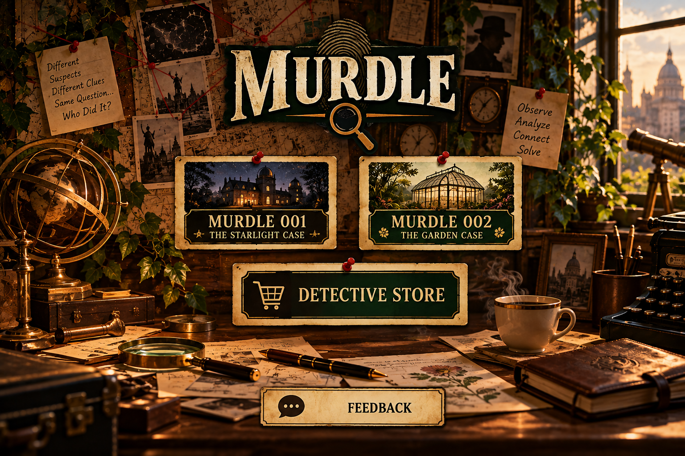
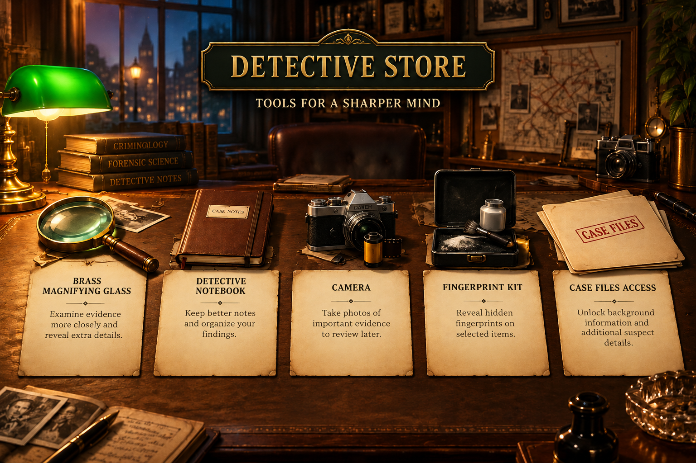

# 🔍 Murdle: A Detective Mystery Game

A cozy, old-fashioned detective game for Windows. Read the suspect files, study the
clues, visit the locations, and make your accusation: **who** did it, **where**, and
**with what**?



---

## 🎮 Play the game

1. Go to the **[latest release](../../releases/latest)**.
2. Under **Assets**, click **`Murdle.exe`** to download it.
3. Double-click `Murdle.exe` to play. Nothing else to install!

> **Seeing a warning?** That's normal for games from new, independent creators.
> - If your **browser** says the file "isn't commonly downloaded", choose **Keep**.
> - If a blue box says **"Windows protected your PC"**, click **More info** → **Run anyway**.

**Requirements:** Windows 10 or 11.

---

## 🕵️ The cases

**Case #001: The Mystery Begins**
Film producer Victor Marlowe is found dead shortly before a private screening at
Starlight Studios. A silent film star, a screenwriter, and a costume designer all had
reasons to want him gone.

**Case #002: Death in the Glass Garden**
Renowned botanist Dr. Adrian Bell is found dead inside the Orchid Crown Conservatory.
Solve Case #001 to unlock this one.

Each case has:
- 📁 **Suspect, location, clue and evidence files** to investigate
- 📝 **A detective's notebook** for your own notes
- ⚖️ **A final accusation**: get the suspect, location *and* weapon right

---

## 🛒 The Detective Store



Solving a case earns you **Detective Funds**. Spend them on tools that give you an
edge in the next case. You can't afford everything, so choose wisely!

| Item | What it does |
|---|---|
| 🔍 Brass Magnifying Glass | Reveals a big hint, but only once |
| 📓 Detective Notebook | Unlocks a clickable **deduction grid** (✗ / ✓) |
| 📷 Camera | Two evidence photos you can review anytime |
| 🧤 Fingerprint Kit | A forensic report with hidden fingerprints |
| 📂 Case Files Access | A confidential witness file that opens **only twice** |

---

## 💬 Feedback

Use the **Feedback** button on the main menu to rate the game and leave a comment.
It's sent anonymously and helps make future cases better!

---

## 💾 Your progress

Your coins, solved cases and purchases are saved automatically on your own computer, in:

```
%APPDATA%\Murdle\save_data.json
```

To start over, delete that file (or, if you're running from the source code,
double-click `reset_progress.bat`).

---

## 🛠️ For developers: run from the source code

Made with **Python**, **tkinter**, **pygame-ce** and **Pillow**.

1. Install [Python](https://www.python.org/downloads/) (3.12 or newer).
2. Download this project (green **Code** button → **Download ZIP**) and unzip it.
3. Open a terminal in the project folder and install what the game needs:
   ```
   py -m pip install -r requirements.txt
   ```
4. Start the game:
   ```
   py Murdle.py
   ```

**To build `Murdle.exe` yourself:** double-click `build_exe.bat`.
The finished game appears in the `dist` folder.

### Project files

| File | What it is |
|---|---|
| `Murdle.py` | Starts the game (and becomes `Murdle.exe`) |
| `main.py` | Main menu and feedback window |
| `case_001.py`, `case_002.py` | The two mystery cases |
| `Store.py` | The Detective Store and its items |
| `navigation.py` | Moves the player between screens |
| `save_manager.py` | Loads and saves progress |
| `feedback_sender.py` | Sends player feedback online |
| `assets/`, `sounds/` | Pictures and sounds |
| `build_exe.bat` | Builds `Murdle.exe` |
| `reset_progress.bat` | Resets your saved progress |

---

## 📜 License & credits

Created by Karla Barahona.
The code is shared under the [MIT License](LICENSE).

*This is an independent fan-made game. It is not affiliated with or endorsed by the
"Murdle" puzzle books by G.T. Karber.*
